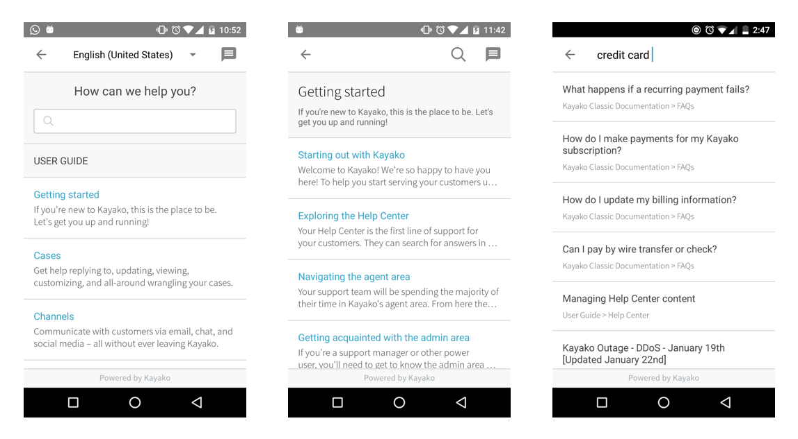

 [  ](https://bintray.com/kayako-support/kayako-devkits/kayako-messenger/_latestVersion)

# Overview

Our Mobile Support SDK enables you to add the Kayako Help Center to your apps in a plug-and-play fashion. We'll be introducing more features soon. 

# Getting Started

In order to use the code in this SDK, you need to add the following to your _build.gradle_ file. 

```java
    repositories {
        maven { 
            url "http://dl.bintray.com/kayako-support/kayako-devkits"    
        }
    }

    dependencies {
        compile 'com.android.support:appcompat-v7:24.2.0'
        compile 'com.android.support:recyclerview-v7:24.2.0'
        compile 'com.android.support:support-v4:24.2.0'
        compile 'com.android.support:design:24.2.0'

        compile 'com.squareup.okhttp3:okhttp:3.4.1'
        compile 'com.squareup.okio:okio:1.9.0'
        compile 'com.google.code.gson:gson:2.4'
        compile 'com.github.bumptech.glide:glide:3.7.0'

        compile 'com.kayako.messenger:kayako-messenger:0.0.1' 
        compile 'com.kayako:kayako:0.0.3'
    }
```

# Sample Usage

A simple example to retrieve open the help center.

```java
    buttonToOpenHelpCenter.setOnClickListener(new View.OnClickListener() {
        @Override
        public void onClick(View view) {
            Kayako.getInstance().openHelpCenter(getContext(), "https://support.brewfictus.com", Locale.US);
        }
    }); 
```


# Screenshots



# Documentation

There are a few steps that need to be taken before you can use the SDK. Head over to [Kayako's Developer Portal](https://developer.kayako.com/sdk/android/integration_guide/) and follow the Integraton Guide. 


