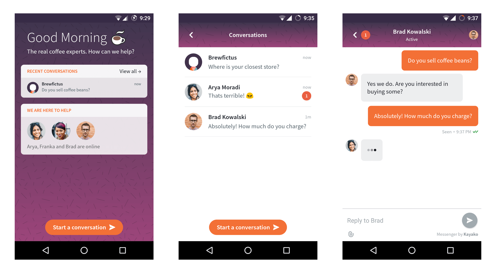

 [  ](https://bintray.com/kayako-support/kayako-devkits/kayako-messenger/_latestVersion)

# Overview

Our Mobile Support SDK enables you to add a knowledge base (Helpcenter) and an in-app chat (Messenger) to your apps in a plug-and-play fashion.


# Getting Started

In order to use the code in this SDK, you need to add the following to your _build.gradle_ file. 

```java
 android {
     //...
     packagingOptions {
         exclude 'META-INF/LICENSE'
     }
 }

 dependencies {
     //...
     compile 'com.kayako.messenger:kayako-messenger:1.0.+'
 }
```

There are a few more steps that need to be taken before you can use the SDK. Head over to [Kayako's Developer Portal](https://developer.kayako.com/messenger/android/integration_guide/) and follow the Integraton Guide. 

# Screenshots




