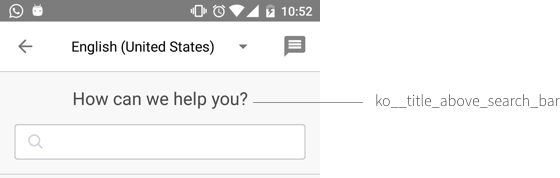
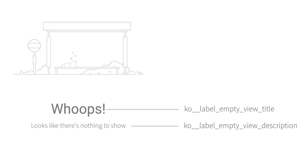
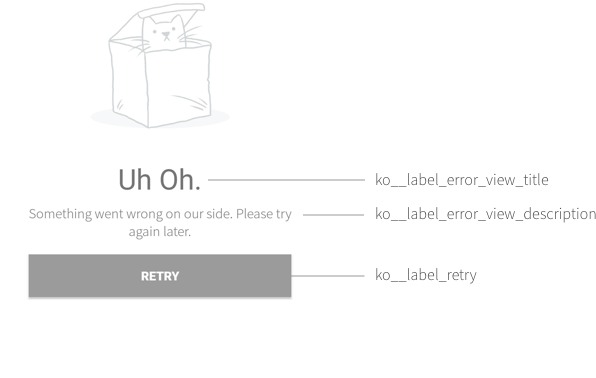
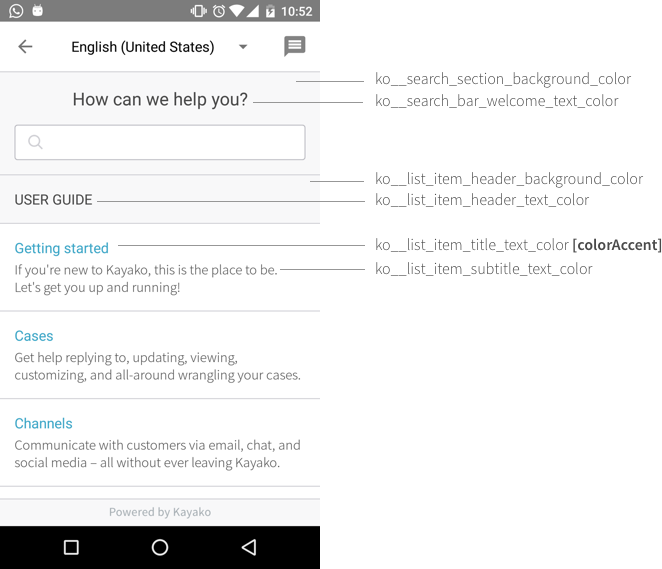
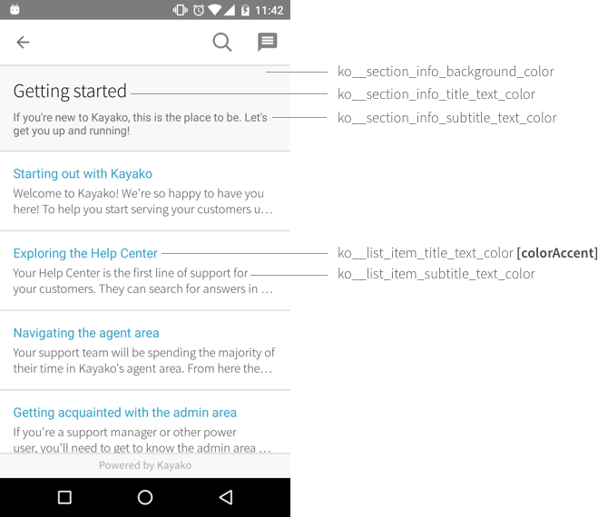
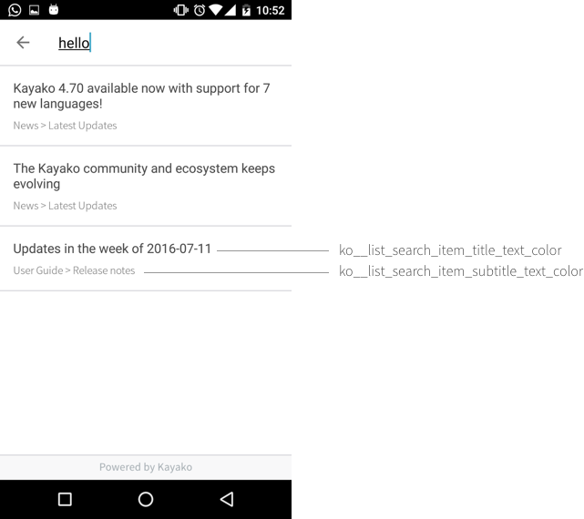
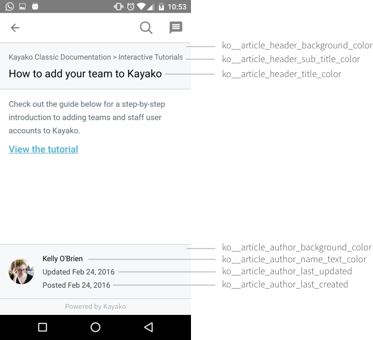
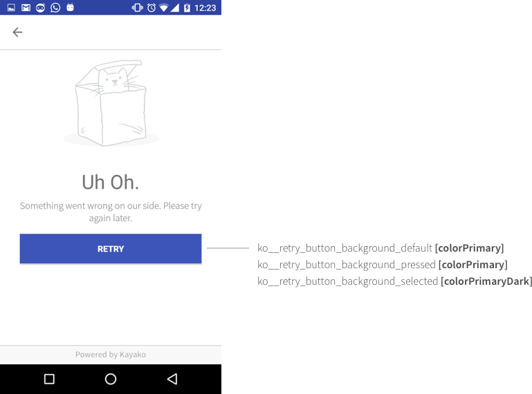

# Overview

This SDK wraps the Kayako Developer APIs and is provided as an Android Library project that can be included in your application.

# Integration Guide

## Version Requirements

|Property|Version No.|
|---|---|
|targetSDKVersion|23|
|compileSDKVersion|23|
|buildToolsVersion|23|
|minSDKVersion|14|

# Getting Started

To get started, please follow the instructions below:

### Step 1: Android Manifest

Add the following lines to your Android Manifest:


```xml
        <!-- Paste this inside the Application tags -->
        <activity
            android:name="com.kayako.sdk.android.k5.activities.KayakoHelpCenterActivity"
            android:theme="@style/HelpCenterTheme" />

        <activity
            android:name="com.kayako.sdk.android.k5.activities.KayakoSearchArticleActivity"
            android:launchMode="singleTask"
            android:theme="@style/Ko__SearchArticlePageTheme"
            android:windowSoftInputMode="adjustPan|stateVisible" />

        <activity
            android:name="com.kayako.sdk.android.k5.activities.KayakoArticleActivity"
            android:theme="@style/HelpCenterTheme" />
```

### Step 2: Styles

Paste the following lines to your res/values/styles.xml file. 

```xml
    <style name="HelpCenterTheme" parent="Ko__AppTheme">
        <item name="colorPrimary">@color/colorPrimary</item>
        <item name="colorPrimaryDark">@color/colorPrimaryDark</item>
        <item name="colorAccent">@color/colorAccent</item>
    </style>
```

You can modify the three colours to style the help center activities to match with your own app theme. 
Note: For advanced customization, read the later sections.  

### Step 3: Gradle Build Dependencies

Add the following lines to your Gradle dependency:

```gradle
dependencies {
    compile fileTree(dir: 'libs', include: ['*.jar'])

    // Add the following dependencies to get the Support SDK to work
    compile 'com.android.support:appcompat-v7:24.2.0'
    compile 'com.android.support:recyclerview-v7:24.2.0'
    compile 'com.android.support:support-v4:24.2.0'
    compile 'com.android.support:design:24.2.0'
    compile 'com.squareup.okhttp3:okhttp:3.4.1'
    compile 'com.squareup.okio:okio:1.9.0'
    compile 'com.google.code.gson:gson:2.4'
    compile 'com.github.bumptech.glide:glide:3.7.0'
    
    // The following jar files are required for the Kayako Help Center
    compile 'com.kayako.sdk.android:1.0.0' 
    compile 'com.kayako.sdk.java:1.0.0'
}
```

### Step 4: Application

In your Application class, add the following:

```java
    KayakoHC.initialize(this);
```

### Step 5: Progaurd

If you’re using progaurd, please add the following the code to your progaurd-project.txt file

```groovy
# OkHttp3
-keepattributes Signature
-keepattributes *Annotation*
-keep class okhttp3.** { *; }
-keep interface okhttp3.** { *; }
-dontwarn okhttp3.**

# Glide

-keep public class * implements com.bumptech.glide.module.GlideModule
-keep public enum com.bumptech.glide.load.resource.bitmap.ImageHeaderParser$** {
    **[] $VALUES;
    public *;
}

# Kayako Android SDK

-keep class com.kayako.sdk.android.k5.** { *; }
-dontwarn com.kayako.sdk.android.k5.**
-keepattributes InnerClasses

# Android

-keep class android.support.v4.** { *; }
````

_For more information on progaurd, access the progaurd documentation: [http://developer.android.com/tools/help/proguard.html](http://developer.android.com/tools/help/proguard.html)_

### Step 6: Open Intent

Place the following lines of code where you want the Help Center to be opened:

```java
    KayakoHC.getInstance().openHelpCenter(context, helpCenterUrl, defaultLocale);
```

For example:
```java
    KayakoHC.getInstance().openHelpCenter(getContext(), "https://support.kayako.com", new Locale("en","us");
```

# Customization

## String Customization 

You can override the following strings by overriding them in your *res/values/strings.xml* file. 

|Id |Description |Default Value|
|---|---|---|
|ko__title_above_search_bar|Title used above the search header on Help Center page|How can we help you?|
|ko__title_help_center|Title on Help Center Toolbar if there are no public locales|Help|
|ko__label_search_hint|Hint on the Search Toolbar|Search here...|
|ko__label_retry|Label used for the Error Page button to reload page|Retry|
|ko__label_empty_view_title| Label used for the title in the empty view|Whoops!|
|ko__label_empty_view_description| Label used for the description in the empty view|Looks like there\'s nothing to show|
|ko__label_error_view_title| Label used for the title in the error view|Uh Oh.|
|ko__label_error_view_description|Label used for the description in the error view|Something went wrong. Please try again later.|
|ko__action_contact|Label for the Contact Menu Button|Contact|
|ko__action_search|Label for the Search Menu Button|Search|
|ko__msg_error_type_at_least_three_characters_to_search|Error message when less than 3 characters used for search|Please type at least 3 characters to search!|
|ko__msg_error_unable_to_load_more_items|Error message when loading more items in a list fails|Something went wrong. Unable to load more items.|


You can use the images below to see the most significant strings used in the app.









## Localization

You can add localizations of your language of choice. Just use the above strings and organize it in a separate folder.
For example, values-ru for russian.

```
.
├── res
|   ├── values-ru
|   |   ├── strings.xml
|   └── values-en
|       ├── strings.xml
```

## Design

### Simple Customization

For simple customization, you only need to add the material colors (*res/values/colors.xml*) for the help center to match your application's theme. 

```xml
<color name="colorPrimary"></color>
<color name="colorPrimaryDark">#7C7C7C</color>
<color name="colorAccent">#3AA6C5</color>
```

### Advanced Customization

For a more advanced customization, you can override the following colors in your HelpCenterTheme (Step 2 of Getting Started). 











For example, you can make changes to the HelpCenterTheme in the following manner:

```xml
    <style name="HelpCenterTheme" parent="Ko__AppTheme">
    
        <!-- Simple Customization -->
        <item name="colorPrimary">@color/colorPrimary</item>
        <item name="colorPrimaryDark">@color/colorPrimaryDark</item>
        <item name="colorAccent">@color/colorAccent</item>
        
        <!-- Advanced Customization -->
        <item name="ko__section_info_background_color">@color/blue</item>
        <item name="ko__section_info_title_text_color">@color/white</item>
        <item name="ko__section_info_subtitle_text_color">@color/white</item>

    </style>

```

## Trouble Shooting

**Errors**

|Error Name|Description|
|---|---|
|HELP_DESK_URL_NOT_INITIALIZED|Help Desk Url has not been initialized in the app. Please mention the help desk url when initializing the sdk in the Application class.|


## Change Log

####v1.0.0
- First Iteration
